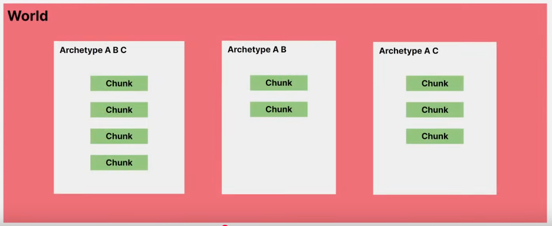
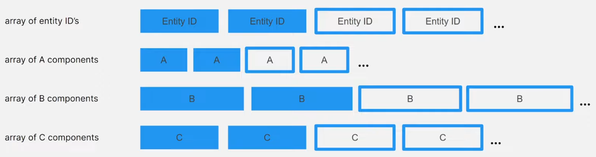
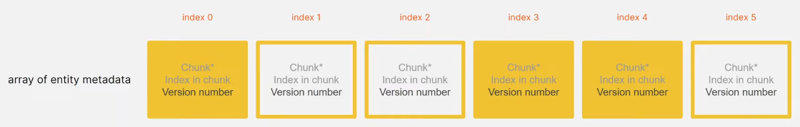

[Back to summary...](../../)

# Unity Entities

## [Entity](https://docs.unity3d.com/Packages/com.unity.entities@1.3/manual/concepts-entities.html)

- Lightweith unmanaged alternative to GameObject
- Has a unique int id number.
- Has components (but can only have one component of each type).
- No built in concept of parenting, instead the standard Parent component contains a reference to another entity allowing to create entity transform hierarchies.
- Stored in array which make it efficient to access in bulk with what is called a QUERY.

## [Component](https://docs.unity3d.com/Packages/com.unity.entities@1.3/manual/concepts-components.html)

- Must be a struct.
- Interface IComponentData has no method but mark struct as a component type.
- Component can contain only unmanaged data type and can reference to other entities in the form of an entity id.
- Component are meant to be purely data so they usually don't have any methods even if there no issue adding one.


```C#
public struct MyComponent : IComponentData
{
    // Data stored in the component
    public int PowerLevel;
    public int PowerDamage;
    public float PowerCooldown;
}
```

Allowed field types in a component:
- [Blittable types][1]
- `bool`
- `char`
- [`BlobAssetReference<T>`][2], a reference to a Blob data structure
- [`Collections.FixedString`][3], a fixed-sized character buffer
- [`Collections.FixedList`][4]
- Fixed array (only allowed in an unsafe context)
- [Unity.Mathematics][5] types
- Other struct types that conform to these same restrictions.

[1]: https://learn.microsoft.com/en-us/dotnet/framework/interop/blittable-and-non-blittable-types
[2]: https://docs.unity3d.com/Packages/com.unity.entities@1.3/api/Unity.Entities.BlobAssetReference-1.html
[3]: https://docs.unity3d.com/Packages/com.unity.collections@2.5/api/Unity.Collections.FixedString.html
[4]: https://docs.unity3d.com/Packages/com.unity.collections@2.5/api/Unity.Collections.FixedList32Bytes-1.html
[5]: https://docs.unity3d.com/Packages/com.unity.mathematics@1.3/manual/index.html

>! It's actually possible to define managed component type that may contains other managed object by applying IComponentData to a class but they will have the same efficiency problems of gameObjects so it should be used unless strictly necessary.

### Types of components

This section won't be exhaustive, there are many differents types of component with different purpose. The complete list of component types and how to use them can be found [here](https://docs.unity3d.com/Packages/com.unity.entities@1.3/manual/components-type.html).

#### Tag component

A component with no data and only used to identify all entities that representing something. They are very useful for queries.

For example, if I want to access all the entities representing a tree I can add them a *Tree* tag component and query this *Tree* tag component to get them all.

```c#
// A tag component is just a normal component with no data
public struct MyTagComponent : IComponentData
{
}
```

#### DynamicBuffer component

A dynamic buffer is a component type that is a resizable array.

It is a struct that implements the interface `IBufferElementData`.
```C#
public struct MyDynamicBufferComponent : IBufferElementData
{
    public float3 Value;
}
```

The buffer of each entities stores:
- **A length**: number of elements in the buffer, start at 0 and increments each time a value is added in the buffer.
- **A capacity**: amount of storage in the buffer, start by matching internal buffer capacity (`128/sizeof(T)` by default) but can be specified with `[InternalBufferCapacity()]` attribute. Setting `Capacity` resizes the buffer.
- **A pointer**: indicate the location of the buffer content. Initially set to `null` to tell the content is stored in the chunk itself. When the capacity exceed the internal buffer capacity, the content is copied into a new larger array allocated outside of the chunks and the pointer is set to point to this new array.

Internal buffer capacity and external capacity (if present) are deallocated when the `EntityManager` destroys the chunk itself.

> **Note:** when a dynamic buffer is stored outside of the chunk, the internal capacaity is wasted and acccessing the content require following an extra pointer. **These costs can be avoided by making sure the internal capacity is never exceeded** but staying within this limit may require an excessively large internal capacity. **Another options is to set the internal capacity to 0**, the buffer will always be stored outside of the chunk and we will still follow an extra pointer when accessing content but we won't waste unused sapce in the chunk.

The `EntityManager` has key methods for dynamic buffers:
- **`AddComponent<T>()`:** Add a component of type *T* to an entity, where *T* can be a dynamic buffer component type.
- **`RemoveComponent<T>()`:** Remove a component of type *T* to an entity, where *T* can be a dynamic buffer component type.
- **`AddBuffer<T>()`:** Adds a dynamic buffer component of type *T* to an entity and returns the new buffer as a `DynamicBuffer<T>`.
- **`HasBuffer<T>()`:** Returns `true` if an entity currently has a dynamic buffer component of type *T*.
- **`GetBuffer<T>()`:** Returns an entity's dynamic buffer component of type *T* as a `DynamicBuffer<T>`.

`DynamicBuffer<T>` represent the dynamic buffer component of type *T* of an individual entity. It has the following key properties and methods:
- **`Length`:** Gets or sets the length of the buffer.
- **`Capacity`:** Gets or sets the capacity of the buffer.
- **`Item[Int32]`:** Gets or sets the element at a specified index.
- **`Add()`:** Adds an element to the end of the buffer, resizing it if necessary.
- **`Insert()`:** Inserts an element at a specified index, resizing if necessary.
- **`RemoveAt()`:** Removes the element at a specified index.

## World (Collection of entities)
- To create an entity, we first need a world which is a container for entities.
- Every entity in a world has an ID that is unique in that world but an entity of another world might have the same ID.
- In most of the case one world is enough but creating several world can be interesting to create logical separation (ex: DOTS Net package create different world for server and clients)
- A world also owns [systems][systems], which are unit of codes that run on the main thread (usually once per frame). Generally, the entities of a world are only accessed by the world's systems and the jobs scheduled by them.

[systems]: EntitiesSystems.md

## Entity manager
Manage the entities of a world, that what provide the methods to do changes on the entities. Here is a list of possible methods:

- Create an entity
- Destroy an entity
- Instantiate an entity (create a new entity with a copy of all the components of an existing entity)
- Add a component on an entity
- Remove a component on an entity
- Set a component on an entity
- Get a component on an entity

Those changes can be divided in two categories: Strutural and non-strutural changes.

- Structural change: operation that may modify the archetypes and chunks (Create, Instantiate and Destroy entity, Add and Remove component).
- Non-Structural change: operation that have no impact on the archetypes and chunks (Set and Get component).

> **!** Frequently moving many entities between archetypes may have a significant performance cost.

## Archetype and chunks

### Archetype

<p align="center"></p>  
Store all entities that have a specific set of component in a world.

Archetypes are automatically created by the entity manager when we create or modify entities, we don't have to create arfchetypes manually. If all entities are removed from an archetype, the archetype is not destroyed, an archetype is only destroyed when its world is destroyed.

>That's why adding or removing a component move the entity to a new archetype.

### Chunk

<p align="center"></p>  
Block of data with an uniform size that store entity and component inside an archetype (see https://youtu.be/jzCEzNoztzM?si=bqLii5e3EdTnh6bM&t=371).

- The number of entity contained in a chunk depends on the number and size its the components and a chunk can contain a maximum of 128 entities.
- A chunk is composed of an array for the entity ID and an array for each type of component.
> Example: for an entity with 3 components (A, B and C), the chunk will have an array for the entity ID and 3 arrays for the components (1 for A, 1 for B and 1 for C).
- Entities stored in a chunk are always thighly packed (=no empty slot in the array) at the beginning of the array so new entities are always placed at the first free slot available. If an entity is removed, the last entity is moved to fill the gap.
- Chunk creation and destruction is handled by the entity manager: a new chunk is created when an entity is added but all chunks are already full and a chunks is destroyed when its last entity is removed (this is a strutural change).

> Strutural changes on chunks can only be made on the main thread, the only way to do it with jobs is to use an `EntityCommandBuffer` as a workaround.

## Entity metadata

<p align="center"></p>  
To allow to lookup entities by ID the world entity manager must maintain an array of entity metadata.

- each entity ID correspond to a slot in a metadata array.
- the slot contains:
    - a pointer to the chunk where the entity is stored, if no entity exist for a particular index the chunk pointer is null
    - the index of where the entity is stored within the chunk
    - a version ID, incremented everytime the entity at the index is destroyed to allow to reuse the entity index (if a the version ID doesn't match with the one already stored then the id must refers to an ID alreday destroyed or that may have never existed)

## Query

A request to efficiently find all entities with a specific set of component types. A query gather all the chunks which include the required component(s) regardless of the other components in chunk.

- In a query, we can require specific components and the query return all the chunks from the archetypes that contains the components.
- If we need to, we can also exclude specific components in the query to get the chunks only from archetypes that contains component(s) and doesn't contains other component(s).

> Example: With 3 Components (A, B and C) and 3 Archetypes (ABC, AB, AC).
>
>- If we query A and C -> we will get the chunks from archetypes ABC and AC (because they are the only one who contains A and C).
>- If we query A, C and we exclude B -> we will only get chunks from archetype AC (because it the only who contains A, C and doesn't contains B).

Archetypes matching a query are cached until a new archetypes is added to the world. Since the number of existing archetypes in world should stabilize early in the program lifetime, caching usually helps to make queries much faster.

## Access entity and components with jobs

To do that we can use 2 special jobs types:

- IJobEntity: iterate over entities matching a query (https://docs.unity3d.com/Packages/com.unity.entities@1.3/manual/iterating-data-ijobentity.html)
- IJobChunk: iterate over the chunk matching a query (https://docs.unity3d.com/Packages/com.unity.entities@1.3/manual/iterating-data-ijobchunk.html)

>In general IJobEntity is the most convenient way. IJobChunk will provide explicit low level control so it may be needed to fallback to it for some special cases not covered by IJobEntity.

[See here for detailed informations.](JobsWithECS.md)

## Baking

Entities cannot be directly included in unity scene so a build time process called baking convert the gameobjects into serialized entities.  
To add entities in a scene we create a subscene. One entity is created for each gameobject in a subscene and each component of each gameObject is processed by a Baker. The Baker is a class which add and set the component values of the entities.  
The result of the baking is serialized in a entity scene file which is loaded at runtime when the main scene is loaded.  
>Baked entities can be further processed by a baking system before being serialized for more advanced use cases.

