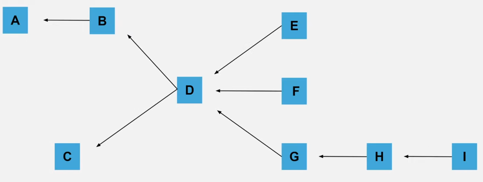

# Unity Jobs

## Resources links

- [EntityComponentSystemSamples github repository](https://github.com/Unity-Technologies/EntityComponentSystemSamples/tree/master?tab=readme-ov-file)
- [Document Unity Job System 101](https://docs.google.com/document/d/1gtXwUwsuQTfpBUmdFd5ieZaL7v3UdYTKq9H5P0M57Mg/edit?tab=t.0) 
- [Unity job system video](https://www.youtube.com/watch?v=jdW66hA-Qu8)
- [Unity job system documentation](https://docs.unity3d.com/6000.0/Documentation/Manual/job-system.html)
- [Watch this if you've never tried JOBS in Unity (Tutorial)](https://www.youtube.com/watch?v=6gFyoMoa8dM)
- [Unity.Collections cheat sheet](https://github.com/Unity-Technologies/EntityComponentSystemSamples/blob/master/EntitiesSamples/Docs/cheatsheet/collections.md)
- [Unity.Mathematics cheat sheet](https://github.com/Unity-Technologies/EntityComponentSystemSamples/blob/master/EntitiesSamples/Docs/cheatsheet/mathematics.md)

## What is the job system ?

A job is a small unit of work that aim to complete a specific task and that can run on a worker thread. The goal of the job system is to use multithreading and takes advantage of the multiple cores of modern CPU to reduce the amount of operation runned on the main thread by running the jobs on worker threads parrallely from the main thread.

Contrary to other multithreading technique such as [thread pooling](https://en.wikipedia.org/wiki/Thread_pool), the job system always make sure that the number of thread match to the CPU capacity which means we can schedule as many task as we want want without having to known how many CPU cores are available.

### How works jobs?

**Only the main thread can schedule and complete jobs**. When we schedule a job, the main thread add the job to the global job queue. When an idle worker thread will look for a new work, it will pull the job off the queue to run it. Once the main thread need the result of the job, it can complete the job **(complete is used synchronise jobs with the main thread)**. The main thread will then check if the job is already finished and if that's not the case it will wait for the end of the job. When we complete a job, all records of the job are removed from the work queue, so a job that has been scheduled must always be completed by the main thread at some point to avoid resource leak.

While a job is running the **main thread cannot access it's content** and **two jobs cannot access the same content at the same time**. We can use [jobs dependencies](#jobs-dependencies) to make sure two jobs will access the same content but one after the other.

> **A job that has been scheduled must always be completed by the main thread at some point to avoid resource leak**

**For improved performance, jobs must be combined with the [Burst Compiler](https://docs.unity3d.com/Packages/com.unity.burst@1.8/manual/index.html) which is specifically designed to compile jobs.**

### Jobs data and parameters

Just like a method call, a job receives parameters and operates on data. However, to be able to use the Burst Compiler, jobs must use unmanaged objects so we need to use specific [thread safe types](https://docs.unity3d.com/6000.0/Documentation/Manual/job-system-native-container.html). For example instead of using a standard array of int (*int[]*), we will use native array (*NativeArray<int>*) from [Unity.Collections](https://docs.unity3d.com/6000.0/Documentation/ScriptReference/Unity.Collections.NativeArray_1.html) namespace.  

#### Thread safe types:

- [Blittable types](https://learn.microsoft.com/en-us/dotnet/framework/interop/blittable-and-non-blittable-types): type that has a representation both in managed and unmanaged memory (ex: *Byte*, *Int16*, *Int32*, *Single*, *Double*, ...).
- [Unity.Collections](https://docs.unity3d.com/6000.0/Documentation/ScriptReference/Unity.Collections.NativeArray_1.html) namespace: Provide native containers which are unmanaged data structures that can be used in jobs and burst-compiled code (ex: *NativeArray<T>*, *NativeSlice<T>*). The [Collection package](https://docs.unity3d.com/Packages/com.unity.collections@2.5/manual/index.html) also add additional NativeContainer such as *NativeList<T>*.
- [Unity.Mathematics package](https://docs.unity3d.com/Packages/com.unity.mathematics@1.3/manual/index.html): C# math library that provides vector types and math functions that have a shader-like syntax. It is used by the burst compiler to compile C#/IL code into highly efficient native code.
- It's possible to [create our own custom native container](https://docs.unity3d.com/6000.0/Documentation/Manual/job-system-custom-nativecontainer.html) using [*[NativeContainer]* attribute](https://docs.unity3d.com/6000.0/Documentation/Manual/job-system-custom-nativecontainer-example.html).

> With Native collection types, the developer is responsible for calling *.Dispose()* on the unmanaged collection once it's no longer needed. Neglecting to dispose a collection will create a memory leak.

#### Data access general rules

- A job should not perform I/O.
- A job should not access managed objects.
- A job should only access static fields if they are read only.
- Scheduling a job create a private copy of the struct that will be visible only to the running job, so any modification on the fields of the job will be visible only within itself. However, if a field of job contains pointers or references, the modification of this external data by the job can be visible outside of the job.

#### Managed and unmanaged objects?

- Managed objects: Pure .Net code managed by runtime and under its control, will be handled by the garbage collector.
- Unmanaged objects: Code not managed by the runtime, the garbage collector won't know how to manage it.

> **Is it possible to use managed object in a job?**  
> ! It's not strictly impossible to use managed objects in jobs but doing it safely require a special care so normally jobs show avoid accessing managed objects. Also, Burst Compiler doesn't support managed objects so the job won't be able to use it.

#### Allocator (Unmanged collections)

When we instantiate an unmanaged collection we must define a type of allocator. Every type of allocator will organize and track their memory differently.  
```C#
NativeArray<int> myArray = new NativeArray<int>(arrayLength, Allocator.TempJob)
```  
The most commons allocators are:

- **Temp**: the fastest allocator, it is used for short-lived allocations and will only last one frame, we don't even need to call *.Dispose()* on it. A collection with that allocator **cannot be passed into jobs**, however **it is safe to use within jobs so it possible to create temp allocated NativeArray inside a job** (Temp allocation will be disposed automatically at the end of the job).
- **TempJob**: middle speed, slower than Temp allocation but faster than Persistent. This allocator **can be passed into jobs** and **must be manually disposed (call *.Dispose()*) within 4 frames after allocation** otherwise safety checks will throw an exception.
- **Persistent**: slowest allocator, it is used for indefinite lifetime allocations and we must call *.Dispose()* to deallocate the collection once we no longer need it. **It can be passed into jobs**.

#### Other remarks

> **Use of delta time in a job**  
> Delta time must be copied to the job since jobs generally don't have concept of a frame. The main thread waits for the job on the same frame or the next frame, but the job should perform work in a deterministic and independent way when running on worker threads.

## [Create and Instantiate a job](https://docs.unity3d.com/6000.0/Documentation/Manual/job-system-creating-jobs.html)

### Create a job

A job is a struct that implements the interface IJob. The interface add a method Execute(), it's the method that will be invoked when the job will run.

> **!** When we declare a job, it must always be a struct

> *[BurstCompile]* attribute allow the job to use the burst compiler to increase it's performance.

```c#
using Unity.Burst;
using Unity.Collections;
using Unity.Jobs;

[BurstCompile] // Enable burst compilation on the job
public struct MyJob : IJob
{
    // Declaration of the data that will be accessed in the jon
    public NativeArray<int> SomeInts;

    public void Execute()
    {
        // The code that will be executed by the job
        for (int i = 0; i < SomeInts.Length; i++)
        {
            SomeInts[i] = 1;
        }
    }
}
```

> If we declare a job variable with the *[ReadOnly]* attribute, multiple jobs will be allowed to access its data in parrallel since we don't write the data.   
> ```c#
> [ReadOnly]
> public NativeArray<Vector3> SomeVector3;
> ```

### Instantiate, schedule and complete a job

To run our job we need to instantiate it in the main unity loop (Start(), Update(), ...). We create a new variable using the type of the job we created (here *MyJob*) and we pass the data we want to process in the declaration of *MyJob*.

Once we instantiated our job, we can schedule it. To schedule it we just call the job *.Schedule()* method and assign it to a *JobHandle* variable. The *JobHandle* identify a job that has been scheduled and allow us to *.Complete()* it or to create job dependencies.

When the main thread need to get the result from our job, it need to calls *.Complete()*. This will check if the job has been completed and if it's not the case the main thread will wait for the job before continuing to execute the code.

> To use jobs optimally, we usually wants to schedule it early in a frame, do other stuff and complete the job later in the frame when the job result is needed. Completing a job immediately after scheduling it will prevent the jon to be completed in parrallel of the main thread.

> If we want to immediately execute the job of the main thread, we can call the job *.Run()* method (this can be used for debugging purpose).

```c#

// Declare a native array
NativeArray<int> myArray = new NativeArray<int>(1, Allocator.TempJob) // See below for more details on NativeArray instantiation

// Instantiate the job
var job = new MyJob { SomeInts = myArray }; 

// Schedule the job (Put the job in the global job queue)
JobHandle handle = job.Schedule();

// ... some other code that runs until we need the result of our job

// Complete the job
handle.Complete() // Complete() should always be called at some point after a job has been scheduled to avoid resource leak

// Use the data processed in the job
Debug.Log(myArray[0]); // All copies of a Native Array points to the same array in the memory so we don't have to access the result job.SomeInts

// Once we used our NativeArray and don't need it anymore we need to the space allocated in the memory
myArray.Dispose()
```

> **Native Array instantiation** 
> ```c#
> NativeArray<int> myArray = new NativeArray<int>(1, Allocator.TempJob)
> ```
>  When we instantiate a Native Array the first parameter define the size of the array and the second array define the [type of memory allocation](https://docs.unity3d.com/6000.0/Documentation/ScriptReference/Unity.Collections.Allocator.html). [Check here for more details](https://docs.unity3d.com/6000.0/Documentation/Manual/job-system-native-container.html).

### Schedule and Complete best pratices

- Call *.Schedule()* as soon as you have the data the job needs and call *.Complete()* only when you need the result of the job.
- Less important jobs can be scheduled in a part of the frame where they are not competing with other jobs.
    - For example, if a latency of one frame is acceptable between the end of a frame and the beginning of next frame
    - If a part of the frame is already saturated by jobs, schedule the job in another part where it's under-utilized.
- In the profiler, check for the marker **WaitForJobGroupID** on the main thread, it shows where Unity is waiting for a job to complete. It can show a data dependency that may be resolved.
- **Avoid using long running jobs**. Contrary to threads, jobs don't yield execution so once a job start the worker commit to complete the job before starting another one. It's best to break up long running jobs into smaller jobs that depends on one another.
    - If the jobs system is filled with long running job they might consume all worker thread and block independent job execution which could increase the completion time of important jobs awaited by the main thread.
    - In particular long running *(IJobParallelFor)[]* negatively impact the job system because this type of job intentionnely tries to fill more worker thread as possible. If it's not possible to break up long [parrallel jobs](), try to increase the batch size to [limit how many worker will pick this job](#Avoid-long-running-parrallel-job-taking-all-threads).

## [Jobs dependencies](https://docs.unity3d.com/6000.0/Documentation/Manual/job-system-job-dependencies.html)

Since two jobs cannot access the same data conccurently it often needed that a job waits for the result of another job. To do that we can specify a dependency when we schedule a job, this will mean that the job we schedule is dependent of the job we passed as dependency and therefore it cannot be exectuted until its dependency has been executed.

### Simple dependency

To make *secondJob* dependent of *firstJob* we just need to pass the JobHandle of *firstJob* in the parameter when we schedule *secondJob*.  
The job system will first execute *firstJob* and when it will finis

``` C#
var firstJob = new MyJob { Numbers = intArray };
var secondJob = new MyJob { Numbers = intArray };

JobHandle handleFirstJob = firstJob.Schedule();
JobHandle handleSecondJob = secondJob.Schedule(handleFirstJob); // Pass the handle of the first job when scheduling second job

// Calling .Complete() is only needed on the second job because calling .Complete() on a job calls it on all its dependencies
handleSecondJob.Complete();
```

> Calling *.Complete()* on a JobHandle will also call it on all its dependencies so in this case we only need to call it on *handleSecondJob* since it depends on *handleFirstJob*.

### Chain dependency

A dependency can also have a dependency so it is possible to create a chain of dependency.  
Here we have this chain of dependency A <- B <- C <- D (D depends on C which depends on B which depends on A so the execution order is A => B => C => D).

``` C#
var aJob = new MyJob { Numbers = intArray };
var bJob = new MyJob { Numbers = intArray };
var cJob = new MyJob { Numbers = intArray };
var dJob = new MyJob { Numbers = intArray };

JobHandle handleAJob = aJob.Schedule();
JobHandle handleBJob = bJob.Schedule(handleAJob); // B depends from A
JobHandle handleCJob = cJob.Schedule(handleBJob); // C depends from B
JobHandle handleDJob = dJob.Schedule(handleCJob); // D depends from C

// Calling .Complete() is only needed on D job because calling .Complete() on a job calls it on all its dependencies
handleDJob.Complete(); // Here D.Complete() calls C.Complete(), which calls B.Complete(), which calls A.Complete()
```

> We only need to call .Complete() on job D because it will call .Complete() on its dependencies. Then D dependencies will call .Complete() on their own dependencies and so on.  
> So here D .Complete() calls C .Complete(), which calls B .Complete(), which calls A .Complete().

### One dependency for several jobs

Several jobs can have the same dependency. In the example below A is the dependency of B, C and D. A will be executed first, then B, C, and D will be executed conccurently.

``` C#
var aJob = new MyJob { Numbers = intArray };
// ! B, C and D cannot all use intArray since they could be scheduled conccurently, so for this example I created different array for C and D
var bJob = new MyJob { Numbers = intArray }; 
var cJob = new MyJob { Numbers = secondIntArray }; 
var dJob = new MyJob { Numbers = thirdIntArray }; 

JobHandle handleAJob = aJob.Schedule();
JobHandle handleBJob = bJob.Schedule(handleAJob); // B depends from A
JobHandle handleCJob = cJob.Schedule(handleAJob); // C depends from A
JobHandle handleDJob = dJob.Schedule(handleAJob); // D depends from A

// A.Complete() is not needed since it's a dependency of B,C and D but B.Complete(), C.Complete() and D.Complete() are needed otherwise they will never be called
// -> Calling .Complete several time on A (once for each of the job that depends on its) is harmless.
handleBJob.Complete();
handleCJob.Complete();
handleDJob.Complete();
```

> In this case we need to call .Complete() on B, C and D otherwise it will never be called since they are not a dependency of another job.  
> Job A .Complete() will be called several time since several jobs depends on it (once for each of job that depends on it) but this is harmless and has not impact on performance.

### One job with several dependencies

One job can also have several dependencies. To do that instead, of passing one JobHandle as dependency, we will created a new JobHandle and assign it a combination of several handle with *JobHandle.CombineDependencies()*.  
Here A depends from B, C and D. So once B, C, and D execution will be finished, A will be executed.

``` C#
var aJob = new MyJob { Numbers = intArray };
// ! B, C and D cannot all use intArray since they could be scheduled conccurently, so for this example I created different array for C and D
var bJob = new MyJob { Numbers = intArray };
var cJob = new MyJob { Numbers = secondIntArray };
var dJob = new MyJob { Numbers = thirdIntArray };

JobHandle handleBJob = bJob.Schedule();
JobHandle handleCJob = cJob.Schedule();
JobHandle handleDJob = dJob.Schedule();

// Combine handle of B, C and D
JobHandle combinedHandle = JobHandle.CombineDependencies(handleBJob, handleCJob, handleDJob);
JobHandle handleAJob = aJob.Schedule(combinedHandle);

// We only need to call A.Complete() because all others jobs are its dependecies
handleAJob.Complete();
```

> Calling .Complete() on A will call it on its dependencies so we only need to call it on A and it will be also called on B, C and D.

### Complex combination of dependencies

All of the previous type of dependency can be combined together to create complex graph of dependencies.  
The example below reproduce this graph of dependencies.  
<p align="center"></p>  

``` C#
var aJob = new SimpleJob { Numbers = intArray };
var bJob = new SimpleJob { Numbers = secondIntArray };
var cJob = new SimpleJob { Numbers = thirdIntArray };
var dJob = new SimpleJob { Numbers = intArray };
var eJob = new SimpleJob { Numbers = secondIntArray };
var fJob = new SimpleJob { Numbers = thirdIntArray };
var gJob = new SimpleJob { Numbers = intArray };
var hJob = new SimpleJob { Numbers = intArray };
var iJob = new SimpleJob { Numbers = intArray };

// Start A and C
JobHandle handleAJob = aJob.Schedule();
JobHandle handleCJob = cJob.Schedule();

// B depends from A
JobHandle handleBJob = bJob.Schedule(handleAJob);

// D depends from B and C
JobHandle HandleBCJob = JobHandle.CombineDependencies(handleBJob, handleCJob);
JobHandle handleDJob = dJob.Schedule(HandleBCJob);

// E,F,G depends from D
JobHandle handleEJob = eJob.Schedule(handleDJob);
JobHandle handleFJob = fJob.Schedule(handleDJob);
JobHandle handleGJob = gJob.Schedule(handleDJob);

// H depends from G
JobHandle handleHJob = hJob.Schedule(handleGJob);

// I depends from H
JobHandle handleIJob = iJob.Schedule(handleHJob);

// The tip of the graph are jobs E, F and I so we need to call .Complete() on them to call complete on all the jobs
handleEJob.Complete();
handleFJob.Complete();
handleIJob.Complete();
```

> With a complex graph of dependencies we only need to call *.Complete()* on every tips of the graph and *.Complete()* will be reccursively called on every jobs in the graph. In this case we only need to call it on jobs E, F and I.

### Avoid cyclic dependencies (Should not be possible)

Cyclic dependencies (A depends from B and B depends from A) is something that must not be done. One of the job would be stuck forever waiting for the other job to end.
**Anyway it should not be possible since a job can only depends from a job that has been scheduled and because once scheduled it's not possible to change the dependencies of a job.**

## [Parralel jobs](https://docs.unity3d.com/6000.0/Documentation/Manual/job-system-parallel-for-jobs.html)

One task can only be done by one job, however there is time where we need to perform the same operation on a lots of objects. Instead of running one big job that repeat the same operation on all the items sequentially, it's more efficient to split the work in different batch and run theses batch on several worker thread conccurently. To do this, there is a specific types of jobs: parralel jobs. 

### [IJobParralelFor](https://docs.unity3d.com/6000.0/Documentation/ScriptReference/Unity.Jobs.IJobParallelFor.html)

*IJobParralelFor* is an interface just like IJob and when creating our parralel job we will implements it in our struct instead of Ijob.
*IJobParralelFor* adds an *Execute()* method like *IJob*. However, contrary to *IJob* which only calls the *Execute()* method once, with *IJobParralelFor* *Execute()* will be invoked once per item in the NativeArray we used as data source. Each call will process a single element based on an index parameter passed by the execute function.
Since the goal of *IJobParralelFor* is to iterate over a NativeArray we also must provide a NativeArray of data when we create a parralel job.

#### Create a parrallel job

``` C#
using Unity.Burst;
using Unity.Collections;
using Unity.Jobs;

[BurstCompile] // Enable burst compilation
public struct MyParrallelJob : IJobParallelFor // Instead of using IJob, we use IJobParallelFor interface
{
    public NativeArray<int> SomeInts;

    public void Execute(int index)
    {
        SomeInts[index] = SomeInts[index] + 1;
    }
}
```

#### Instantiate, schedule and complete a parralel job

Most of the process is the same for a parralel job and a normal job. The main differences are the parameters of the *.Schedule()* method.  

The *.Schedule()* requires two parameters:
1.Length of the array (how many for-each iterations to perform)
2.Batch Count, how many item will there be in one batch (every batch will be able to run on a different worker)

> Example: if we have 246 items, and set a batch size of 100, all items will be processed in 3 batches (batch 1: 0-99, batch 2: 100-199, batch 3: 200-246)

``` C#
// Declare a native array
NativeArray<int> myArray = new NativeArray<int>(999, Allocator.TempJob) // See below for more details on NativeArray instantiation

//  Instantiate the parralel job
var job = new MyParrallelJob { SomeInts = intArray };

// Schedule the parralel job
JobHandle handle = job.Schedule(intArray.Length, 64); // We need to pass the array length and a btahc size

// ... some other code that runs until we need the result of our job

// Complete the job
handle.Complete(); 

// Dispose intArray manually since it's a native Array
intArray.Dispose();
```

#### Batch size tips

- When there is a lot of work in each iteration then a value of 1 can be sensible.
- When there is very little work values of 32 or 64 can make sense.
- It is needed to experiment and profile to find the best batch size in term of performance because with simple computation the bottleneck could be memory access (https://youtu.be/jdW66hA-Qu8?si=l12_EYkXmcGaDnl2&t=610). **Starting at 1 and increasing the batch count until there are negligible performance gains is a good strategy**.

### [IJobParallelForTransform](https://docs.unity3d.com/6000.0/Documentation/ScriptReference/Jobs.IJobParallelForTransform.html)

This seems to work mostly like *IJobParralelFor* but instead of passing an array length and a batch count, we only need to pass a [*TransformAccessArray*](https://docs.unity3d.com/6000.0/Documentation/ScriptReference/Jobs.TransformAccessArray.html). A *TransformAccessArray* is an array of [TransformAccess](https://docs.unity3d.com/6000.0/Documentation/ScriptReference/Jobs.TransformAccess.html) and is needed to be able to access the transform data in a job.

I still have some question about this adn I need to test it in Unity:
- Is this compatible with the Burst compiler?
- Why is it part of Unity.Engine.Jobs namespace and not Unity.Jobs like IJobParallelFor?

### Avoid long running parrallel job taking all threads

To avoid a long running parrallel job to run on all the worker threads we can define the batch size to make sure it will only run on a specific number of thread.  
In the example below we execute the parrallel job only on half of the worker threads available.

``` C#
MyParallelJob jobData = new MyParallelJob();
jobData.Data = someData;  
jobData.Result = someArray;  

// Use half the available worker threads, clamped to a minimum of 1 worker thread
const int numBatches = Math.Max(1, JobsUtility.JobWorkerCount / 2); 
const int totalItems = someArray.Length;
const int batchSize = totalItems / numBatches;

// Schedule the job with one Execute per index in the results array and batchSize items per processing batch
JobHandle handle = jobData.Schedule(result.Length, totalItems, batchSize);
```


