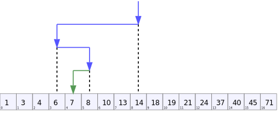

# Notes on things non-related to DOTS and ECS

## Summary

- [Array binary search](#array-binary-search)
- [Comparer, IComparer<T> interfaces](#icomparer-icomparer-comparer-and-icomparable)
- [Bitwise and shift operation](#bitwise-and-shift-operations)
- [Other things to check later](#other-things-to-check-later)

## [Array binary search](https://learn.microsoft.com/en-us/dotnet/api/system.array.binarysearch?view=net-9.0)

Allow to search a sorted one dimensional array using a binary search algorithm.

**[Binary search](https://en.wikipedia.org/wiki/Binary_search):** search algorithm to find the value of an item in a sorted array. Binary search compare the target value with the middle of the array, if they are not equal we reproduce the operation with the half our target value is part of. This is repeated until we found the target value or until there is no more value to check meaning the value is not in the array.  
<p align="center"></p>  

> **! Binary search only work with array that were previously sorted**.

### Search a specific value

```C#
int[] someInts = new int[] { 2, 8, 9, -4, 3, -6, 1 };

// We need to sort the array before doing the binary search
Array.Sort(someInts); // Sorted Array = [-6, -4, 1, 2, 3, 8, 9]

int elementIndex = Array.BinarySearch(someInts, 8); // return the index of 8 in sorted array
```

### Search nearest value

**If the binary search doesn't find the exact specified value, it will return a negative integer** (the bitwise negation of the last-searched index to be precise). When it's the case **we can flip the bit ([Bitwise operation](#bitwise-and-shift-operation)) on the index found to get the last index we searched**. This last index will point to the last element that was close to our specified element.

We can use that to find the index of the value is the nearest from what we were looking for. We can start from the last index searched and look upward and downward in the array until we are getting away from the value searched.

> If the index found is one greater than the upper bound of the array, there are no elements larger than value in the array. Otherwise, it is the index of the first element that is larger than value

```c#
int valueSearched = 5;
int[] someInts = new int[] { 2, 8, 9, -4, 3, -6, 1 };

// We need to sort the array before doing the binary search
Array.Sort(someInts); // Sorted Array = [-6, -4, 1, 2, 3, 8, 9]

int startIndex = Array.BinarySearch(someInts, valueSearched); // return bitwise negation of the last-searched index since the value searched is not in the array

// If the value is negative, we flip the bits to get the last index searched
if (startIndex < 0) startIndex = ~startIndex; // bits flip operation

// Ensure the index is not out of the array, if it is that mean there is no element larger than the value in the array so our start index is the last index.
if (startIndex >= someInts.Length) startIndex = someInts.Length - 1;

int currentNearestValue = someInts[startIndex];
int currentNearestIndex = startIndex;

// Local method to avoid writing the same code twice for upward and downward search
void Search(int start, int end, int step, ref int nearestValue, ref int nearestIndex)
{
    for (int i = start; i != end; i += step)
    {
        int valueDiff = valueSearched - someInts[i];
        int nearestDiff = valueSearched - nearestValue;

        // Ensure diff are positive
        if (valueDiff < 0) valueDiff *= -1;
        if (nearestDiff < 0) nearestDiff *= -1;

        Console.WriteLine($"index {i} | {valueDiff} > {nearestDiff} = {valueDiff > nearestDiff}");
        if (valueDiff > nearestDiff)
        {
            break;
        }
        else
        {
            nearestValue = someInts[i];
            nearestIndex = i;
            Console.WriteLine($"New nearest: value={nearestValue}, index={nearestIndex}");
        }
    }
}

// Search Upward
Search(startIndex + 1, someInts.Length, +1, ref currentNearestValue, ref currentNearestIndex);

// Search Downward
Search(startIndex - 1, -1, -1, ref currentNearestValue, ref currentNearestIndex);

Console.WriteLine($"Nearest value is {currentNearestValue} at index {currentNearestIndex}");
```

## IComparer, IComparer<T>, Comparer<T> and IComparable<T>()

*IComparer* and *IComparer<T>* are interfaces that implement a *Compare()* method. The object that implement these interface can be used to give instructions to sort values or to do a [binary search](#array-binary-search) in an array.  
*Comparer<T>* works the same way but it's a class instead of an interface so you need to derive from it and implement its abstract method. *Comparer<T>* class implements *IComparer<T>* interface so it has all it's features.

The *Compare()* method return a int that indicate if an object is less than, equal or greater than another, so inside *Compare()* we add the criteria we will use to define that. The *Sort()* method use the value returned by *Compare()* to know how to order the objects in the array.

*IComparable<T>* is also an interface, implementing it allow to define a generalized comparison method for a value type or class. To simplify, it allow us to define a default compare method.

### [IComparer](https://learn.microsoft.com/en-us/dotnet/api/system.collections.icomparer?view=net-9.0)

*IComparer* interface is only used to sort a string array or do to binary search in it. When we sort a string array without providing a comparer, the default comparer is used and sort the array in alphabetical order. By providing our own comparer it allow us to customize how we want to sort the array. 

In this example, we create a comparer that sort the array in a reversed alphabetical order.

```C#
public class ReverseComparer : IComparer
{
    public int Compare(object x, object y)
    {
        // Compare two string and ignore the casing
        return new CaseInsensitiveComparer().Compare(y, x); // y and x are inverted to reverse the order
    }
}

static void Main(string[] args)
{
    string[] someFruit = new string[] { "Peach", "Apple", "Strawberry", "Kiwi" , "Banana", "Mango" };

    Array.Sort(someFruit, new ReverseComparer());
    // Sorted array: [Strawberry,Peach,Mango,Kiwi,Banana,Apple]
}
```

### IComparer<T> and Comparer<T>

*IComparer<T>* works exactly like *IComparer* but instead of comparing strings we provide a specific type that should be compared. In *Compare()* we also define the criteria that will tell if an object is less than, equal or greater than another and we can use the variable defined in our type to customize the comparer.

*Comparer<T>* is not an interface, it is a class that already implements *IComparer<T>* and can be derived from. When a class derive from *Comparer<T>*, you will have to implement the abstract method *Compare()* that work exactly like *Compare()* from *IComparer<T>*.

**Althought it must be used in some cases like a binary search, it's generally recommened to create a class that derived from Comparer<T> instead of implementing IComparer<T>.**

#### [Comparer<T>]()

> Is it possible to do a binary search with this ?

```C#
// Comparer using a custom class Coordinate which just contains some x,y coordinate
public class CoordinateComparer : Comparer<Coordinate>
{
    public override int Compare(Coordinate x, Coordinate y)
    {
        return x.x.CompareTo(y.x); // Compare using x variable
    }
}
```

#### [IComparer<T>](https://learn.microsoft.com/en-us/dotnet/api/system.collections.generic.icomparer-1?view=net-9.0)

```C#
// IComparer using a custom class Coordinate which just contains some x,y coordinate
public class CoordinateIComparer : IComparer<Coordinate>
{
    int IComparer<Coordinate>.Compare(Coordinate x, Coordinate y)
    {
        return x.x.CompareTo(y.x); // Compare using x variable
    }
}
```

#### Full implementation of both solution

```C#
// Custom class keeping a x and y value
public class Coordinate
{
    public float x, y;
    public Coordinate(float _x, float _y)
    {
        x = _x;
        y = _y;
    }
}

// Comparer<T>
public class CoordinateComparer : Comparer<Coordinate>
{
    public override int Compare(Coordinate x, Coordinate y)
    {
        return x.x.CompareTo(y.x); // Compare using x variable
    }
}

// IComparer<T>
public class CoordinateIComparer : IComparer<Coordinate>
{
    int IComparer<Coordinate>.Compare(Coordinate x, Coordinate y)
    {
        return x.x.CompareTo(y.x); // Compare using x variable
    }
}

static void Main(string[] args)
{
    Coordinate[] someCoordinate = new Coordinate[] { new Coordinate(1f,-1f), new Coordinate(-2.5f, 6f), new Coordinate(8f, 3f), new Coordinate(2f, -2f), new Coordinate(0, -5f), new Coordinate(6f, -7f) };
    // ARRAY: [(1 , -1), (-2.5 , 6), (8 , 3), (2 , -2), (0 , -5), (6 , -7)]

    // Sort using Comparer<T> 
    Array.Sort(someCoordinate, new CoordinateComparer());

    // Sort using IComparer<T>
    Array.Sort(someCoordinate, new CoordinateIComparer());

    // SORTED ARRAY: [(-2.5 , 6), (0 , -5), (1 , -1), (2 , -2), (6 , -7), (8 , 3)]
}  
```

### [IComparable<T>](https://learn.microsoft.com/en-us/dotnet/api/system.icomparable-1?view=net-9.0)

With IComparable<T> the name of the method implemented is *CompareTo()* instead of *Compare()* but it works the same way. We only have one parameter (the other object to compare with) because the first object to compare is now the instance of the object itself.

``` C#
public class Coordinate : IComparable<Coordinate> // Coordinate implements IComparable
{
    public float x, y;
    public Coordinate(float _x, float _y)
    {
        x = _x;
        y = _y;
    }

    int IComparable<Coordinate>.CompareTo(Coordinate other)
    {
        return x.CompareTo(other.y); // Compare using x variable
    }
}

static void Main(string[] args)
{
    Coordinate[] someCoordinate = new Coordinate[] { new Coordinate(1f, -1f), new Coordinate(-2.5f, 6f), new Coordinate(8f, 3f), new Coordinate(2f, -2f), new Coordinate(0, -5f), new Coordinate(6f, -7f) };
    // ARRAY: [(1 , -1), (-2.5 , 6), (8 , 3), (2 , -2), (0 , -5), (6 , -7)]

    // No need to specify how to compare since Coordinate already implements IComparable<T>
    Array.Sort(someCoordinate);
    // SORTED ARRAY: [(-2.5 , 6), (0 , -5), (1 , -1), (2 , -2), (6 , -7), (8 , 3)]
}
```

## [Bitwise and shift operations](https://learn.microsoft.com/en-us/dotnet/csharp/language-reference/operators/bitwise-and-shift-operators)

### Bitwise OR (|) 

### Bitwise AND (&)

### Bitwise NOT (~)

### Bitwise XOR (^)

### Bitwise shifts (>> and <<)

### Resources

[C# documentation](https://learn.microsoft.com/en-us/dotnet/csharp/language-reference/operators/bitwise-and-shift-operators)  
[Alan zucconi blog post](https://www.alanzucconi.com/2015/07/26/enum-flags-and-bitwise-operators/)


## Other things to check later

- Organizing data
  - Quadtree
    - https://fr.wikipedia.org/wiki/Quadtree
    - https://www.geeksforgeeks.org/quad-tree/
    - https://romanglushach.medium.com/what-is-a-quadtree-and-how-it-works-6286791fb46a
    - https://www.youtube.com/watch?v=ybCdeu6amQc
    - https://people.scs.carleton.ca/~maheshwa/courses/5703COMP/16Fall/quadtrees-paper.pdf
    
  - K-d tree
    - https://fr.wikipedia.org/wiki/Arbre_kd
    - https://www.cs.cmu.edu/~ckingsf/bioinfo-lectures/kdtrees.pdf
    - https://www.geeksforgeeks.org/search-and-insertion-in-k-dimensional-tree/
    - https://www.baeldung.com/cs/k-d-trees