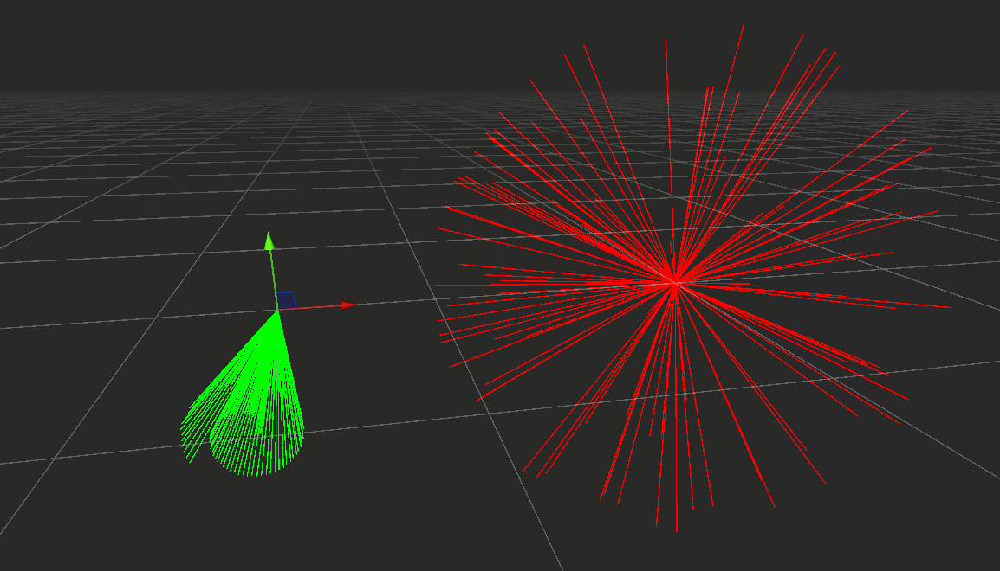

[Back to summary...](../)

# Burst

Summary:
- [What is Burst compiler and how to use it?](#what-is-burst-compiler-and-how-to-use-it)
- [Unity.Mathematics and burst optimized types](#unitymathematics-and-burst-optimized-types)
- [Burst Aliasing](#burst-aliasing)
- [Other burst features](#other-burst-features)

Resources links:
- [Burst unity documentation](https://docs.unity3d.com/Packages/com.unity.burst@1.8/manual/index.html)
- [When, where, and why to put [BurstCompile]](https://discussions.unity.com/t/when-where-and-why-to-put-burstcompile-with-mild-under-the-hood-explanation/896228)
- [C# SIMD-accelerated types doc](https://learn.microsoft.com/en-us/dotnet/standard/simd)
- [Unity Learn: getting the most out of burst](https://learn.unity.com/tutorial/part-3-4-getting-the-most-out-of-burst?uv=2022.3&courseId=60132919edbc2a56f9d439c3&projectId=6013255bedbc2a2e590fbe60#)

## What is Burst compiler and how to use it?

Burst is a compiler than can used with DOTS (Data-Oriented Technology Stack) and especially the job system to improve our performance application. This compiler translate the IL/.Net code to an optimized CPU code that use the [LLVM compiler](https://llvm.org/).

To be able to correctly translate the code, the burst compiler use HPC# (a high performance subset of C#). Most C# expressions and statements are supported by HPC# but the code can only be related to unmanaged objects. Here is the full [list of C# supported and unsupported features in HPC#](https://docs.unity3d.com/Packages/com.unity.burst@1.8/manual/csharp-hpc-overview.html).

To enable the burst compiler we just need to add the `[BurstCompile]` attribute before the element that need to be burst-compiled, however there is some limitation to what can be burst-compiled.

### When and where we should we use burst compiler ?

There are 3 specific cases where the code can be burst compiled with `[BurstCompile]` attribute:

1. When defining a job (a struct implementing an interface `IJob...`), the attribute can be used before the job definition to burst compile the job.
2. When defining an unmanaged entity system (a struct implementing the `ISystem`), the attribute can be used before the definition of ISystem's `OnCreate()`, `OnUpdate()` and `OnDestroy()` methods to burst compile them.
3. When defining a static method, the attribute can used before the method definition to burst compile it.

> **Actually, Burst can only burst compile static methods** in the case of a job or an entity system some magic happen under the hood to make the code burst compilable, [see this developer post for more details](https://discussions.unity.com/t/when-where-and-why-to-put-burstcompile-with-mild-under-the-hood-explanation/896228).

### Burst compiled static method example

Here is an example of a static method using burst compilation:

```c#
[BurstCompile]
public static class MyBurstUtilityClass // a static class that keeps our burst-compiled static method the class must also have the [BurstCompile] attribute
{
    [BurstCompile] // the static method has the [BurstCompile] attribute. Since we use structs, they are passed as reference with in keyword
    public static void BurstCompiled_MultiplyAdd(in float3 mula, in float3 mulb, in float3 add, out float3 result)
    {
        result = mula * mulb + add;
    }
}
```

### What will be burst compiled ?

All the C# called from bursted code is bursted (unless we try really hard to do the opposite). That means that any method called inside burst compiled code will also be burst compiled even if the `[BurstCompile]` attribute was not used on its definition.

For example, in a job with `[BurstCompile]` attribute only the `Execute()` method is burst-compiled, so any method called inside `Execute()` will also be burst-compiled. However, any Non-Execute method in a job a that are not called from burst-compiled code will not use burst compilation even if `[BurstCompile]` is used on it (*the only exception is if the method is static since any static method can be burst compiled*).

## Unity.Mathematics and burst optimized types

When using burst you should use *Unity.Mathematics* package types and API for mathematics operations instead of using the traditional `Mathf` API. The package has its own mathematics types (ex: `float3` instead of `Vector3`, `quaternion` instead of `Quaternion`, `float4x4` instead of `Matrix4x4`) that are optimized for burst and form the basis of Burst SIMD optimizations.

### Unity.Mathematics operators

**It's important to be aware that the arithmetic operators of *Unity.Mathematics* doesn't necessarily behave like the operators for *UnityEngine* types**. With SIMD types like `float3` or `float4x4` almost every operators are applied in a component-wise manner, its might not be the case with `UnityEngine` types.

**This is especially important to remember when working with matrix types**.
 
For example if we have those 2 matrices:

- Matrix A:

$$
\begin{pmatrix}
  3 & 2 & 6 & 4 \\
  5 & 6 & 9 & 5 \\
  6 & 1 & 1 & 2 \\
  7 & 2 & 3 & 4
\end{pmatrix}
$$

- Matrix B:

$$
\begin{pmatrix}
  1 & 6 & 1 & 7 \\
  4 & 3 & 4 & 8 \\
  9 & 2 & 5 & 4 \\
  5 & 2 & 6 & 1
\end{pmatrix}
$$

When multiplying two `Matrix4x4` with `Matrix4x4.operator *`, the result is a standard matrix multiplication: each element of the resulting matrix is the dot product of the rows and columns.

- Matrix4x4 C = Matrix4x4 A * Matrix4x4 B: 

$$
\begin{pmatrix}
  88 & 107 & 95 & 68 \\
  53 & 46 & 43 & 30 \\
  82 & 79 & 89 & 87 \\
  64 & 71 & 72 & 46
\end{pmatrix}
$$

> The result for the first element is dot product of A first column and B first row: C[0,0] = (3,5,6,7) . (1,6,1,7) = 3*1 + 5*6 + 6*1 + 7*7 = 88.

However, when multiplying two `float4x4` with `float4x4.operator *`, the operator does a component-wise operation. **To do a standard matrix multiplication we should use `math.mul()`**.

- float4x4 C = float4x4 A * float4x4 B: 

$$
\begin{pmatrix}
  3 & 20 & 54 & 35 \\
  12 & 18 & 2 & 4 \\
  6 & 36 & 5 & 18 \\
  28 & 40 & 8 & 4
\end{pmatrix}
$$

> The result for the first element is A first element multiplied by B first element: C[0,0] = A[0,0] * B[0,0] = 3 * 1 = 3.

>**! When using `math.mul()` the first argument will be the multiplicator and the second the multiplicated: `math.mul(A, B)` => matrix B * matrix A (and not matrix A * matrix B).**

### Random with Unity.Mathematics

*Unity.Mathematics* also include [`Random`][random], an equivalent of *UnityEngine.Random* to efficiently generate pseudo-random numbers. This `Random` must be initialized with a seed, this seed is used to set a `uint32` field called `state`. When we call one of the [`Next()`][next()] methods on a `Random`, `state` is used as input to generate the new random number and a new random value is assigned to state to ensure the next number generated will be different. **Every `Random` instance that use the same seed will generate the same numbers everytime**, so we need to make sure to use different seed with different instances. If we want the number generated to be be different every time we play, we need to use a different seed for the same instance everytime we play.

#### Create a random instance

There is different way to create a `Random` instance depending on the situation:
- I only create one Random instance:
  - `new Random(seed)`: Provide a seed when creating the instance (the seed must be a `uint` and different from 0).
  - `InitState(seed)`: Create an instance and call `InitState(seed)` on it to initialize the random (the seed must be a `uint` and different from 0).
- I create several Random instance in a loop:
  - `Random.CreateFromIndex(index)`: Call `CreateFromIndex(index)` to create a Random instance from an index, the index is hashed to create the random (index must be a `uint` and different from uint.MaxValue).

#### Why do we need to use `Random.CreateFromIndex()` to create random in a loop ?

When using similar seeds, there is a risk we generate similar numbers and if all our seeds are just incremented by an index, all our seeds will be very similar. When using `Random.CreateFromIndex()` the index is hashed to generate a seed, so every random instance will be instanciated with a seed that is very different from the previous one.

Here is a more visual example, in the image below we have two loop that generate 100 `Random` instance and each of them generate a random float3 direction that is drawn with a using a DebugLine. On the left (in green) the first loop use `new Random(seed)` to instantiate the Random and on the right (in red) the second loop use `Random.CreateFromIndex(index)`. As we can see the directions generated on the left (`new Random(seed)`) points in the same direction and doesn't look random contrary to the direction generated on the right (`Random.CreateFromIndex(index)`).

<p align="center"></p>

#### Use Random with multithreaded code

*Unity.Mathematics* `Random` is very to generate random numbers, however when using it in multithreaded code it requires extra care. We could think it would be a good idea to create a single `Random` instance on the main thread and pass it to every jobs that need to generate randon numbers but this should be avoided: **a job instance copy the data it requires to allow a safe multithreaded code which means every thread will have its own copy of our original `Random` instance** and all of them will have the same seed. So every thread will generate the same numbers. Even worse, `state` value is never copied back from a job instance to our main thread instance, so every frame we will generate the same numbers unless we generate random number directly on the main thread `Random` at some point.

**To avoid this we have several solutions:**
- When working with entities, the simpliest way is simply to have one instance of `Random` per entity that we store in a component. Jobs can use the instance to generate random numbers for this particular entity and the state will stays unique for this entity as long as the component exists.
- We can also create an array of `Random` instances initialized with [`CreateFromIndex()`][createFromIndex()] and the thread or chunk index in the job to select the instance to use.


[random]: https://docs.unity3d.com/Packages/com.unity.mathematics@1.3/api/Unity.Mathematics.Random.html
[next()]:https://docs.unity3d.com/Packages/com.unity.mathematics@1.3/api/Unity.Mathematics.Random.html#Unity_Mathematics_Random_NextBool
[createFromIndex()]:https://docs.unity3d.com/Packages/com.unity.mathematics@1.3/api/Unity.Mathematics.Random.CreateFromIndex.html#Unity_Mathematics_Random_CreateFromIndex_System_UInt32_

## Burst Aliasing

An *Aliasing* is a situation where the code manipulate two references or pointers that point to the same place in memory.

Here is a concrete example:

```c#
int MyMethod(ref int a, ref int b)
{
  b = 13;
  a = 42;
  return b;
}
```

In this method if *a* and *b* point to a different memory location, *b* refers to 13 when we return it. However, if they both point to the same memory location (we can say *a* and *b* alias each other) *b* now refers to 42.

At the compilation time, the compiler doesn't know wether the two references are aliased so it produces a suboptimal assembly code that will guarantee the result will be correct in any case.

**If this code happen in a burst-compiled job and we know *a* and *b* never alias we can use `[NoAlias]` attribute to tell the compiler. Knowing this, the compiler is able to produce a more efficient assembly code.** In our example, we will avoid to load back the content of *b* into the register and we directly returns 13.

To see more way of using `[NoAlias]` to optimize the code generated by the compiler in different situations (method param, method return value, struct, struct fields, jobs), see the [memory aliasing][memoryAliasing] and its [NoAlias section][noAliasSection] in burst documentation. The documentation also show how to use [*Unity.Burst.CompilerServices.Aliasing*][aliasingChecks] to add compile-time checks that ensure our assumptions on aliasing are corrects.


[memoryAliasing]: https://docs.unity3d.com/Packages/com.unity.burst@1.8/manual/aliasing.html
[noAliasSection]: https://docs.unity3d.com/Packages/com.unity.burst@1.8/manual/aliasing-noalias.html
[aliasingChecks]: https://docs.unity3d.com/Packages/com.unity.burst@1.8/api/Unity.Burst.CompilerServices.Aliasing.html

## SIMD Optimization

...

## Other burst features

### Check if code is burst compiled

If we need to check if some code is burst compiled we can use the following code (given by a dev working on Burst). However, this obsiously should not be used to change the behavior of a method since if we do turning burst off will change the behavior.

```C#
[BurstDiscard]
static void SetFalseIfUnBursted(ref bool val)
{
     val = false;
}

public static bool IsBursted()
{
    bool ret = true;
    SetFalseIfUnBursted(ref ret);
    return ret;
}
```

A unity user also proposed this shorter version which seems to have the same behaviour when testing it.

```c#
public static bool IsBursted => Unity.Burst.CompilerServices.Constant.IsConstantExpression(1);
```