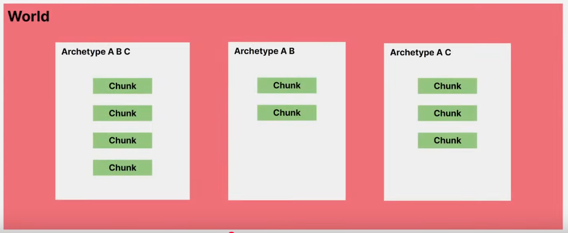
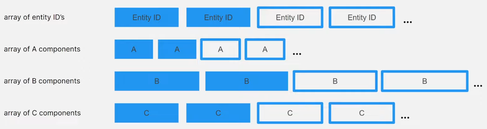
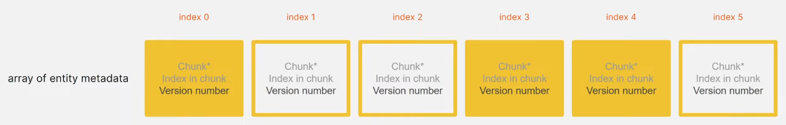

[Back to summary...](../)

# ECS Concepts

Summary:

- [Entity](#entity)
- [Component](#component)
- [Worlds](#world-collection-of-entities)
- [Entity Manager](#entity-manager)
- [Archetype and chunks](#archetype-and-chunks)
- [Entity metadata](#entity-metadata)
- [Query](#query)
- [Access entity and components with jobs](#access-entity-and-components-with-jobs)
- [Baking](#baking)


Resources links:
- [EntityComponentSystemSamples github repository](https://github.com/Unity-Technologies/EntityComponentSystemSamples/tree/master?tab=readme-ov-file)
- [Document Unity Entities 101](https://docs.google.com/document/d/1R6E4IDpfLatwHITlCND0i5TuMVG0CMGsentFL-3RQT0/edit?tab=t.0)
- [Unity entities video](https://www.youtube.com/watch?v=jzCEzNoztzM)
- [Unity ECS concept documentation](https://docs.unity3d.com/Packages/com.unity.entities@1.3/manual/concepts-intro.html)

## [Entity](https://docs.unity3d.com/Packages/com.unity.entities@1.3/manual/concepts-entities.html)

- Lightweith unmanaged alternative to GameObject
- Has a unique int id number.
- Has components (but can only have one component of each type).
- No built in concept of parenting, instead the standard Parent component contains a reference to another entity allowing to create entity transform hierarchies.
- Stored in array which make it efficient to access in bulk with what is called a QUERY.

## [Component](https://docs.unity3d.com/Packages/com.unity.entities@1.3/manual/concepts-components.html)

- Must be a struct.
- Interface IComponentData has no method but mark struct as a component type.
- Component can contain only unmanaged data type and can reference to other entities in the form of an entity id.
- Component are meant to be purely data so they usually don't have any methods even if there no issue adding one.

>! It's actually possible to define managed component type that may contains other managed object by applying IComponentData to a class but they will have the same efficiency problems of gameObjects so it should be used unless strictly necessary.

[Detailed components notes are here.](Components.md)

## World (Collection of entities)
- To create an entity, we first need a world which is a container for entities.
- Every entity in a world has an ID that is unique in that world but an entity of another world might have the same ID.
- In most of the case one world is enough but creating several world can be interesting to create logical separation (ex: DOTS Net package create different world for server and clients)
- A world also owns [systems][systems], which are unit of codes that run on the main thread (usually once per frame). Generally, the entities of a world are only accessed by the world's systems and the jobs scheduled by them.

[systems]: Systems.md

## Entity manager
Manage the entities of a world, that what provide the methods to do changes on the entities. Here is a list of possible methods:

- Create an entity
- Destroy an entity
- Instantiate an entity (create a new entity with a copy of all the components of an existing entity)
- Add a component on an entity
- Remove a component on an entity
- Set a component on an entity
- Get a component on an entity

Those changes can be divided in two categories: Strutural and non-strutural changes.

- Structural change: operation that may modify the archetypes and chunks (Create, Instantiate and Destroy entity, Add and Remove component).
- Non-Structural change: operation that have no impact on the archetypes and chunks (Set and Get component).

> **!** Frequently moving many entities between archetypes may have a significant performance cost.

## Archetype and chunks

### Archetype

<p align="center"></p>  
Store all entities that have a specific set of component in a world.

Archetypes are automatically created by the entity manager when we create or modify entities, we don't have to create arfchetypes manually. If all entities are removed from an archetype, the archetype is not destroyed, an archetype is only destroyed when its world is destroyed.

>That's why adding or removing a component move the entity to a new archetype.

### Chunk

<p align="center"></p>  
Block of data with an uniform size that store entity and component inside an archetype (see https://youtu.be/jzCEzNoztzM?si=bqLii5e3EdTnh6bM&t=371).

- The number of entity contained in a chunk depends on the number and size its the components and a chunk can contain a maximum of 128 entities.
- A chunk is composed of an array for the entity ID and an array for each type of component.
> Example: for an entity with 3 components (A, B and C), the chunk will have an array for the entity ID and 3 arrays for the components (1 for A, 1 for B and 1 for C).
- Entities stored in a chunk are always thighly packed (=no empty slot in the array) at the beginning of the array so new entities are always placed at the first free slot available. If an entity is removed, the last entity is moved to fill the gap.
- Chunk creation and destruction is handled by the entity manager: a new chunk is created when an entity is added but all chunks are already full and a chunks is destroyed when its last entity is removed (this is a strutural change).

> Strutural changes on chunks can only be made on the main thread, the only way to do it with jobs is to use an `EntityCommandBuffer` as a workaround.

## Entity metadata

<p align="center"></p>  
To allow to lookup entities by ID the world entity manager must maintain an array of entity metadata.

- each entity ID correspond to a slot in a metadata array.
- the slot contains:
    - a pointer to the chunk where the entity is stored, if no entity exist for a particular index the chunk pointer is null
    - the index of where the entity is stored within the chunk
    - a version ID, incremented everytime the entity at the index is destroyed to allow to reuse the entity index (if a the version ID doesn't match with the one already stored then the id must refers to an ID alreday destroyed or that may have never existed)

## Query

A request to efficiently find all entities with a specific set of component types. A query gather all the chunks which include the required component(s) regardless of the other components in chunk.

- In a query, we can require specific components and the query return all the chunks from the archetypes that contains the components.
- If we need to, we can also exclude specific components in the query to get the chunks only from archetypes that contains component(s) and doesn't contains other component(s).

> Example: With 3 Components (A, B and C) and 3 Archetypes (ABC, AB, AC).
>
>- If we query A and C -> we will get the chunks from archetypes ABC and AC (because they are the only one who contains A and C).
>- If we query A, C and we exclude B -> we will only get chunks from archetype AC (because it the only who contains A, C and doesn't contains B).

Archetypes matching a query are cached until a new archetypes is added to the world. Since the number of existing archetypes in world should stabilize early in the program lifetime, caching usually helps to make queries much faster.

More information on how to use query in [iterating over entities section in the systems notes](Queries.md).

## Access entity and components with jobs

To do that we can use 2 special jobs types:

- IJobEntity: iterate over entities matching a query (https://docs.unity3d.com/Packages/com.unity.entities@1.3/manual/iterating-data-ijobentity.html)
- IJobChunk: iterate over the chunk matching a query (https://docs.unity3d.com/Packages/com.unity.entities@1.3/manual/iterating-data-ijobchunk.html)

>In general IJobEntity is the most convenient way. IJobChunk will provide explicit low level control so it may be needed to fallback to it for some special cases not covered by IJobEntity.

[See here for detailed informations.](JobsWithECS.md)

## Baking

Entities cannot be directly included in unity scene so a build time process called baking convert the gameobjects into serialized entities.  
To add entities in a scene we create a subscene. One entity is created for each gameobject in a subscene and each component of each gameObject is processed by a Baker. The Baker is a class which add and set the component values of the entities.  
The result of the baking is serialized in a entity scene file which is loaded at runtime when the main scene is loaded.

>Baked entities can be further processed by a baking system before being serialized for more advanced use cases.

## Blob asset

Blob stand for Binary Large Object, a [blob asset](https://docs.unity3d.com/Packages/com.unity.entities@1.3/manual/blob-assets-concept.html) is an immutable, unmanaged piece of binary data stored in contiguous block of bytes.

> The word asset in blob asset can be misleading, it doesn't means the blob points to a project asset file. A blob asset is only a piece of data in memory. However, that makes them easily serializable into files on disk.

### Blob assets advantage and restrictions

Blob assets are useful for several reasons:
- They are efficient to copy and load because they are fully relocable (internal pointers are expressed as relative offsets so copying the blob is just like copying every byte).
- They can be referenced from entity component although they are stored independently from entities.
- Since they are immutable, they are inherently safe for multiple thread access.

The efficiency of blob assets also comes with a few restrictions:
- They can only contain unmanaged data (so no managed objects, strings or regular arrays).
- They are readonly therefore they can't be changed at runtime.
- To quickly load them, blob asset must only contains value type. It can't contain absolute references to itself and use internal pointers. In addition to standard value type, blob assets also comes with 3 specials data types: [`BlobArray`][blbarray], [`BlobPtr`][blbptr] and [`BlobString`][blbstring].

[blbarray]: https://docs.unity3d.com/Packages/com.unity.entities@1.3/api/Unity.Entities.BlobArray-1.html
[blbptr]: https://docs.unity3d.com/Packages/com.unity.entities@1.3/api/Unity.Entities.BlobPtr-1.html
[blbstring]: https://docs.unity3d.com/Packages/com.unity.entities@1.3/api/Unity.Entities.BlobString.html

### Create a blob asset

To create a blob asset we use [`BlobBuilder`](https://docs.unity3d.com/Packages/com.unity.entities@1.3/api/Unity.Entities.BlobBuilder.html) type:

1. We create a new `BlobBuilder`.
2. We call `BlobBuilder.ConstructRoot()` to construct the root of the blob asset.
3. We fill the blob root object with data.
4. We use `BlobBuilder.CreateBlobAssetReference()` to create a `BlobAssetReference`. When we create the `BlobAssetReference`, the blob asset is copied to its final location.
5. We need to dispose the `BlobBuilder`, once we are done.

```c#
// the data we want to put in the blob asset
struct SomeDataForBlob
{
    public int ValueA;
    public int ValueB;
}

// 1. We create a builder with temporary memory to build the blob asset
BlobBuilder builder = new BlobBuilder(Allocator.Temp);

// 2. We construct the root object for the blob asset, we use keyword ref
ref SomeDataForBlob blobData = ref builder.ConstructRoot<SomeDataForBlob>();

// 3. We fill the blob root object with data
blobData.ValueA = 1;
blobData.ValueB = 2;

// 4. We create the blob asset reference to copy data from builder to it's final place, we use persistent allocation to keep the blob allocated indefinetely
BlobAssetReference<SomeDataForBlob> blobAssetRef = builder.CreateBlobAssetReference<SomeDataForBlob>(Allocator.Persistent);

// 5. We don't need the builder anymore so we can dispose it
builder.Dispose();
```
The blob builder construct the data stored in the blob asset, store the internal references as offsets and copy the finished blob asset into a single allocation referenced by the returned `BlobAssetReference<T>`. 

To access and pass a blob, by reference we must use ref keyword or [`BlobAssetReference`](https://docs.unity3d.com/Packages/com.unity.entities@1.3/api/Unity.Entities.BlobAssetReference-1.html). This guarantee the blob assets will continue to resolve to the right absolute memory address since its data must be relocable.

### Access blob assets on a component

Once we have a `BlobAssetReference`, we can store the reference in a component and access it later. **All parts of a blob asset that contain internal pointers must be accessed by reference**.

```c#
// The component with a BlobAssetReference
struct MyComponent : IComponentData
{
    BlobAssetReference<SomeData> Blob;
}

// Access data in the component
int GetDataFromMyComponent(ref MyComponent component)
{
    // Get reference to the data in our blob asset
    // We need the keyword ref to keep internal reference valid, in this case we only have int so it's not really necessary
    ref SomeData blobData = ref component.Blob.Value;

    // we can access the data in the blob asset
    int valueToReturn;
    if(data.ValueA < 0)
    {
        valueToReturn = blobData.ValueB; // ref is needed if the struct we access contains internal reference, it not the case here
    }
    else
    {
        valueToReturn = blobData.ValueB; // ref is needed if the struct we access contains internal reference, it not the case here
    }
    
    return valueToReturn;
}
```

### Use special types in blob assets (BlobArray, BlobString, BlobPointer)

#### BlobArray

```C#
// The data we want to put in the blob asset
struct SomeData
{
    public int ValueA;
    public int ValueB;
}

struct MyBlobArray // a struct that keep a blob array of SomeData
{
    public BlobArray<SomeData> BlobDatas;
}

// Blob asset construction
BlobAssetReference<MyBlobArray> CreateBlobWithArray()
{
    BlobBuilder builder = new BlobBuilder(Allocator.Temp);
    ref MyBlobArray blobArray = ref builder.ConstructRoot<MyBlobArray>();

    // Allocate room for the SomeData objects in the blob array
    BlobBuilderArray<SomeData> arrayBuilder = builder.Allocate(ref blobArray.BlobDatas, 3); // 3 is the size of the blob array.

    // Initialize data in the array builder
    arrayBuilder[0] = new SomeData {ValueA = 1 , ValueB = 2};
    arrayBuilder[1] = new SomeData {ValueA = 3 , ValueB = 4};
    arrayBuilder[2] = new SomeData {ValueA = 5 , ValueB = 6};

    // We complete the creation of the blob asset
    BlobAssetReference<MyBlobArray> blobAssetRef = builder.CreateBlobAssetReference<MyBlobArray>(Allocator.Persistent)
    builder.Dispose();
    return blobAssetRef;
}
```

#### BlobString

```C#
// The data we want to put in the blob asset
struct SomeData
{
    public int ValueA;
    public BlobString Name;
}

// Blob asset construction
BlobAssetReference<SomeData> CreateBlobWithString(string name)
{
    BlobBuilder builder = new BlobBuilder(Allocator.Temp);
    ref SomeData blobData = ref builder.ConstructRoot<SomeData>();

    blobData.ValueA = 1;
    // Create a new blob string and set it's value
    builder.AllocateString(ref blobData.Name, name)

    // We complete the creation of the blob asset
    BlobAssetReference<SomeData> blobAssetRef = builder.CreateBlobAssetReference<SomeData>(Allocator.Persistent)
    builder.Dispose();
    return blobAssetRef;
}
```

#### BlobPointer

```C#
// The data we want to put in the blob asset
struct SomeData
{
    public BlobPtr<BlobString> FavouriteName; // a pointer to my favorite name in the BlobArray
    public BlobArray<BlobString> Names;
}

// Blob asset construction
BlobAssetReference<SomeData> CreateBlobWithPointer(string name)
{
    BlobBuilder builder = new BlobBuilder(Allocator.Temp);
    ref SomeData blobData = ref builder.ConstructRoot<SomeData>();

    // Allocate room for the SomeData objects in the blob array
    BlobBuilderArray<BlobString> arrayBuilder = builder.Allocate(ref blobData.Names, 3); // 3 is the size of the blob array.

    // Initialize data in the array builder
    builder.AllocateString(ref arrayBuilder[0], "Tom");
    builder.AllocateString(ref arrayBuilder[1], "Juliette");
    builder.AllocateString(ref arrayBuilder[2], "Marwan");

    // Set favorite name element, the pointer point to the third entry in the array
    builder.SetPointer(ref blobData.FavouriteName, ref arrayBuilder[2]);

    // We complete the creation of the blob asset
    BlobAssetReference<SomeData> blobAssetRef = builder.CreateBlobAssetReference<SomeData>(Allocator.Persistent)
    builder.Dispose();
    return blobAssetRef;
}
```

### Dispose BlobAssetReference

Any blob asset allocated at runtime with `BlobBuilder.CreateBlobAssetReference()` must be disposed manually. It doesn't applies to blob asset that were baked in a entity subscene and loaded from disk, these are automatically released when they are not referenced anymore by a component.

```c#
// A system that create a blob asset at runtime
public partial struct BlobAssetInRuntimeSystem : ISystem
{
    private BlobAssetReference<MarketData> _blobAssetReference;

    public void OnCreate(ref SystemState state)
    {
        // Create a blob asset and assign it
        
        using (var builder = new BlobBuilder(Allocator.Temp))
        {
            ref SomeData data = ref builder.ConstructRoot<SomeData>();
            data.ValueA = 1;
            data.ValueB = 2;
            _blobAssetReference = builder.CreateBlobAssetReference<SomeData>(Allocator.Persistent);
        }
    }

    public void OnDestroy(ref SystemState state)
    {
        // We need to dispose of the BlobAssetReference we created at OnDestroy to free it's memory
        _blobAssetReference.Dispose();
    }
}
```

### Bake blob asset and BlobAssetStore


